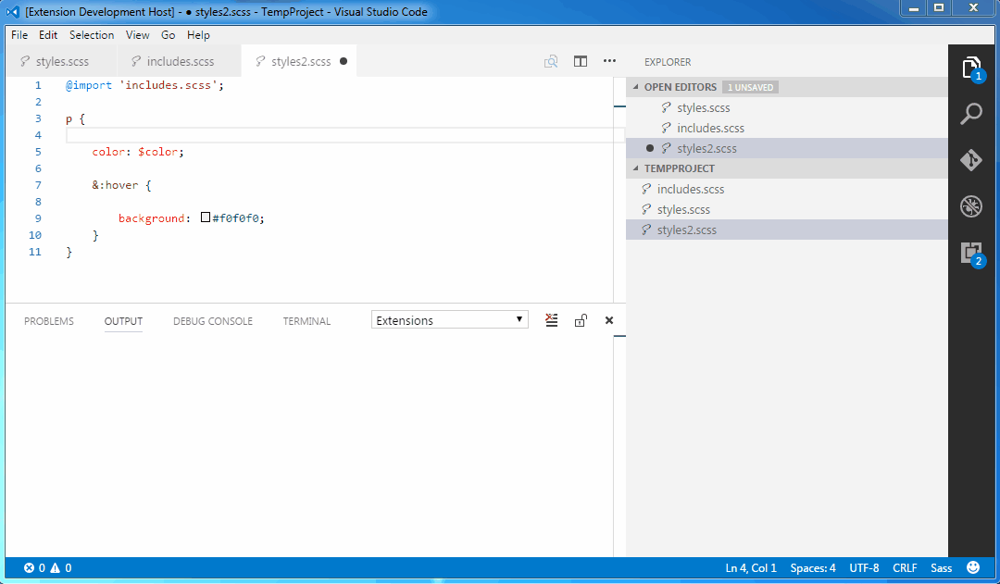

# EasySassNg README

It's about time someone created a standalone extension to compile SASS/SCSS files in Visual Studio Code. Don't you think?

## Features

Automatically compiles SASS/SCSS files to .css and .min.css upon saving. You may also quickly compile all SCSS/SASS files in your project.

## Commands

* `Compile all SCSS/SASS files in the project` - compiles all sass and scss files in selected folder

## Extension Settings

This extension contributes the following settings:

* `easysass-ng.compileAfterSave`: enable or disable automatic compilation after saving
* `easysass-ng.compileRelatedFiles`: enable or disable automatic compilation current file related files after saving
* `easysass-ng.exclude`: glob pattern excluded from compile all and compile related files look up. Leave empty to use vscode setting search.exclude
* `easysass-ng.formats`: specify extensions and formats for exported files.
* `easysass-ng.targetDir`: define target directory for generated files.
* `easysass-ng.excludeRegex`: exclude files from compilation with regular expression

## Release Notes
### [0.0.9]
- 修正README中的配置项名称
### [0.0.8]
- 增加配置项 `easysass-ng.exclude`，用于配置需要排除的文件或文件夹,留空则使用vscode配置的 `search.exclude`搜索排除配置
### [0.0.7]
- 增加过滤node_modules文件夹，提高相关搜索的效率
- 查找相关文件时使用按行读取文件的方式，提高相关搜索的效率
### [0.0.6]
- Update denpendencies
- Add support for compile related files

### [0.0.5]
- Fixed bug with global paths in import directive
- Added support for tilde character in import directive (will resolve to currently opened folder in VS Code)

**Enjoy!**